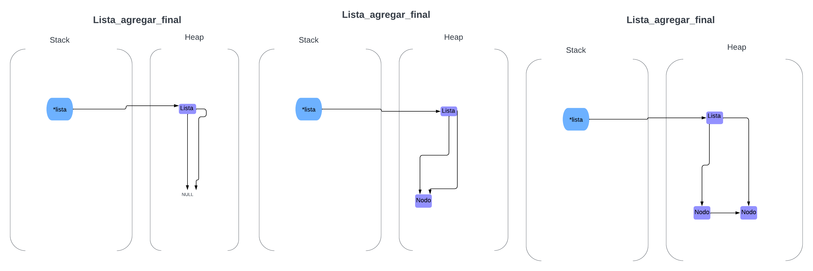

<div align="right">

</div>

# TDA LISTA

## Alumno: Tobías Portella - 112257 - Tobias240405@gmail.com

- Para compilar:
```bash
gcc -std=c99 -Wall -Wconversion -Wtype-limits -pedantic -Werror -O2 -g src/*.c tp_lista.c -o tp_lista
```

- Para ejecutar:
```bash
./tp_lista pokedex.csv
```

- Para ejecutar con valgrind:
```bash
valgrind --leak-check=full --track-origins=yes --show-reachable=yes --error-exitcode=2 --show-leak-kinds=all --trace-children=yes ./tp_lista pokedex.csv
```

---

##  Funcionamiento
---El programa se encarga de recibir un archivo de pokemones con sus atributos y luego almacenarlos en una lista, luego el programa pedira que elijas una de dos opciones las cuales una va a ser imprimir todos los pokemones y sus atributos por pantalla, y la otra va a ser buscar un pokemon escribiendo su nombre por entrada estandar.  

---el programa va a abrir un archivo CSV el cual va a contener los atributos de unos pokemones y lo va leer linea por linea usando la función leer_linea_csv, a esta función se le va a pasar el archivo, la cantidad de columnas que se desean leer, una función que recibe el string leído y un puntero al contexto, y por ultimo recibe también un puntero a un contexto. La función se va a ejecutar hasta que el archivo se quede sin lineas para leer, también se va a ejecutar la función lista_agregar_al_final la cual va a agregar a los pokemones en el orden pasado por el archivo.


<div align="center">

</div>

---luego va a haber un while que va a iterar hasta que se elija una opción por entrada estandar correctamente, las opciones van a ser ingresar el nombre de un pokemon por entrada estandar y buscarlo o mostrar todos los pokemon leidos del archivo por pantalla.

---se utilizan la función imprimir_pokemones_por_pantalla() la cual le pasamos la lista por parametro y lo que hace es usar un iterador externo para recorrer toda la lista con un bucle for y ir obteniendo sus elementos y despues imprimiendolos.

---la otra función es comparar_pokemones_lista() la cual hace lo mismo con el iterador externo y se pasa los pokemones obtenidos por el iterador a otra función que compara el nombre de dos pokemones pasados, si el nombre coincide, la función devuelve el pokemon buscado, y luego este se imprime por pantalla.

<div align="center">

</div>

---luego al finalizar el programa se libera toda la memoria del programa usando sus respectivas funciónes de liberación.

### Respuestas a las preguntas teóricas

## ¿Qué es una lista/pila/cola? Explicar con diagramas.

las listas/pilas/colas son estructuras de datos que se usan para el almacenamiento y la manipulación de datos,estas estructuras son tipos de datos abstractos, ya que cada una de estas estructuras tienen su propía forma para acceder y modificar a estos datos, y también sus propias reglas. 

Lista enlazada: las listas enlazadas son un tipo de dato abstracto que se caracteriza por tener nodos enlazados por punteros los cuales almacenan los datos de la lista, hay diferentes tipos como la lista doblemente enlazada o lista circular enlazada.

<div align="center">

</div>

pila:las pilas son tipos de datos abstractos que siguen la regla de FIFO(First in First out) en las pilas los datos almacenados se van añadiendo uno encima del otro,
como si estuvieras apilando platos, lo mismo es cuando eliminas estos datos el dato eliminado va a ser el del tope, el plato que saques va a ser el de arriba de todo. las principales operaciones son push y pop.

<div align="center">

</div>

cola:las colas son tipos de datos abstractos que siguen la regla de LIFO(Last in First out) en las colas los datos almacenados se van añadiendo al final y los eliminados son los del principio, como en una cola de supermercador.
sus principales operaciones son encolar y desencolar.

<div align="center">

</div>

## Explica y analiza las diferencias de complejidad entre las implementaciones de lista simplemente enlazada, doblemente enlazada y vector dinámico para las operaciones:
   - Insertar/obtener/eliminar al inicio
   - Insertar/obtener/eliminar al final
   - Insertar/obtener/eliminar al medio

# Lista simplemente enlazada:
La implementación de insertar tiene complejidad de O(1) para insertar al principio y para el final ya que simplemente tiene que acceder a los punteros ultimo_nodo/primer_nodo, en cambio para insertar en una posición média es O(n). en el caso de no tener un puntero al ultimo_nodo seria 0(n) para insertar al final

la implementación de obtener es igual O(1) para el principio o final y O(n) para un elemento medio porque tiene que recorrer la lista yendo de puntero en puntero.

Eliminar al inicio tiene una complejidad de O(1)

# Lista doblemente enlazada:
las listas doblemente enlazadas van a tardar un poco mas en la insersión y en eliminar ya que requieren mas operaciones con punteros, su implementación de insertar tiene complejidad de O(1) para insertar al principio y para el final ya que simplemente tiene que acceder a los punteros ultimo_nodo/primer_nodo, en cambio para insertar en una posición média es O(n), en el caso de no tener un puntero al ultimo_nodo seria 0(n) para insertar al final.

la implementación de obtener es igual O(1) para el principio o final y O(n) para un elemento medio porque tiene que recorrer la lista yendo de puntero en puntero.

Eliminar al final tiene una complejidad de O(1) si tiene un puntero al utimo nodo y de 0(n) si no lo tiene

# vector dinamico:
insertar tiene una complejidad de O(n) al principio a la mitad y al final si esta lleno, si no este lleno tiene un complejidad de O(1) al final

la implementación de obtener es O(1) ya que simplemente hay que insertar la posición buscada como indice del vector

Eliminar al medio tiene una complejidad de O(n)


## Explica la complejidad de las operaciones implementadas en tu trabajo para la pila y la cola.

# Pila:
pila_crear() reutilizando lista_crear()la cual era O(1), también es O(1)

pila_destruir() reutilizando lista_destruir() la cual era O(n) porque destruye cada nodo de la lista, también es O(n)

pila_destruir_todo() reutilizando lista_destruir_todo() la cual era O(n*m) porque destruye cada nodo de la lista e invoca una función que no se sabe su complejidad, también es O(n*m)

pila_cantidad() pila cantidad tiene una complejidad de O(1)

pila_tope() pila tope reutiliza la función lista_obtener_elemento() pasandole parametros para que acceda al primer elemento el cual seria el mejor caso de tiempo por lo que es O(1), asi que esta funcion tambíen es O(1)

pila_apilar()pila apilar reutiliza la función lista_agregar_elemento() pasandole parametros para que acceda al primer elemento el cual seria el mejor caso de tiempo por lo que es O(1), asi que esta funcion tambíen es O(1)

pila_desapilar() pila desapilar reutiliza la función lista_quitar_elemento() pasandole parametros para que acceda al primer elemento el cual seria el mejor caso de tiempo por lo que es O(1), asi que esta funcion tambíen es O(1)

pila_esta_vacía() pila esta vacia verifica que el tamaño de la pila sea 0 siendo esta solo una instrucción por lo que seria O(1)

# cola:
cola_crear() reutilizando lista_crear()la cual era O(1), también es O(1)

cola_destruir() reutilizando lista_destruir() la cual era O(n) porque destruye cada nodo de la lista, también es O(n)

cola_destruir_todo() reutilizando lista_destruir_todo() la cual era O(n*m) porque destruye cada nodo de la lista e invoca una función que no se sabe su complejidad, también es O(n*m)

cola_cantidad() cola_cantidad tiene una complejidad de O(1)

cola_frente() reutiliza la función lista_obtener_elemento() pasandole parametros para que acceda al primer elemento el cual seria el mejor caso de tiempo por lo que es O(1), asi que esta funcion tambíen es O(1)

cola_encolar() reutiliza la función lista_agregar_final() la cual es O(1) porque utiliza un puntero que apunta al ultimo nodo, asi que esta funcion tambíen es O(1)

cola_desencolar() reutiliza la función lista_quitar_elemento() pasandole parametros para que acceda al ultimo elemento el cual seria uno de los mejores casos de tiempo por que es O(1), asi que esta funcion tambíen es O(1)

cola_esta_vacía() verifica que el tamaño de la cola sea 0 siendo esta solo una instrucción por lo que seria O(1)